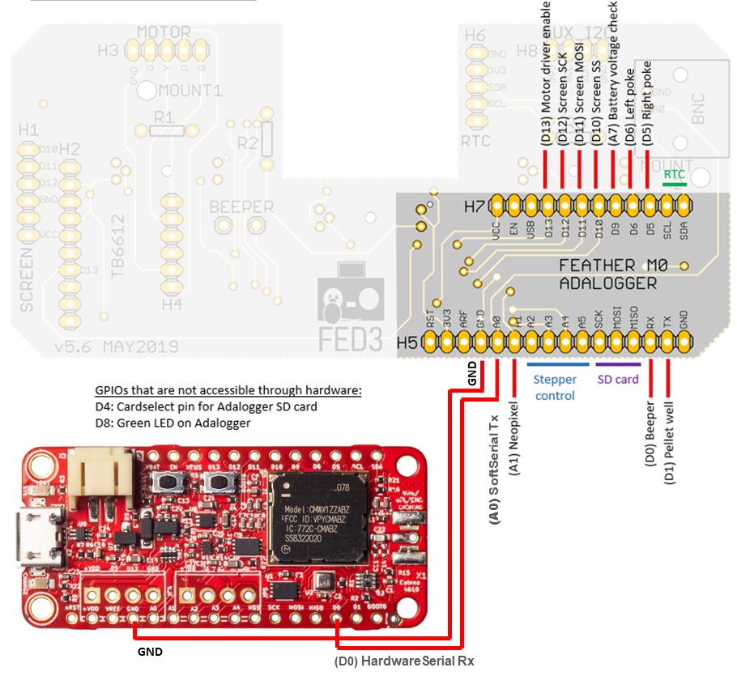
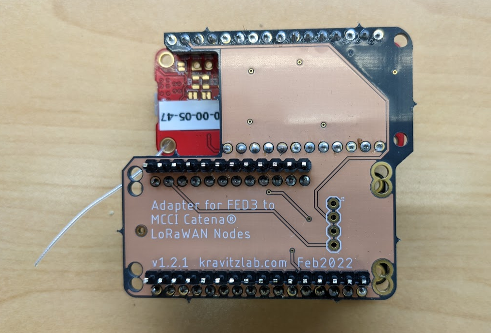
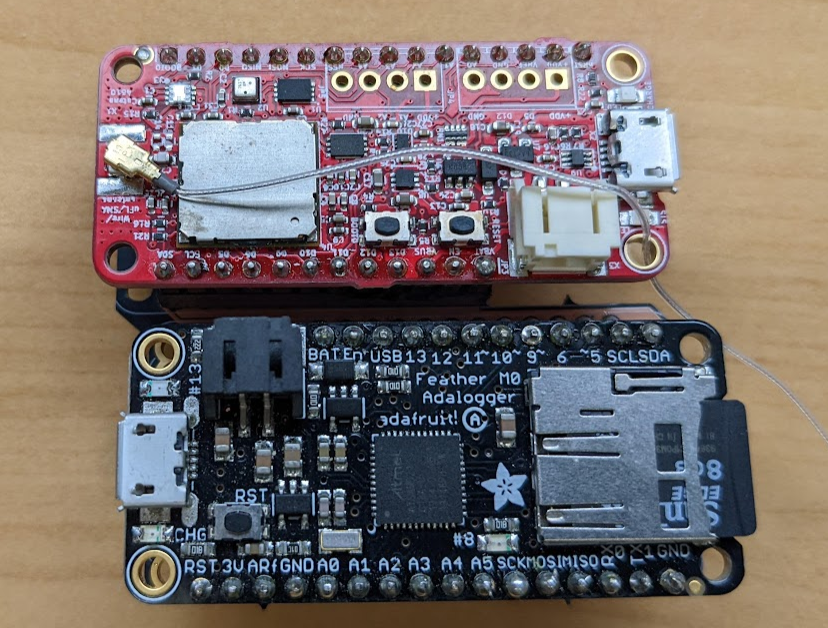
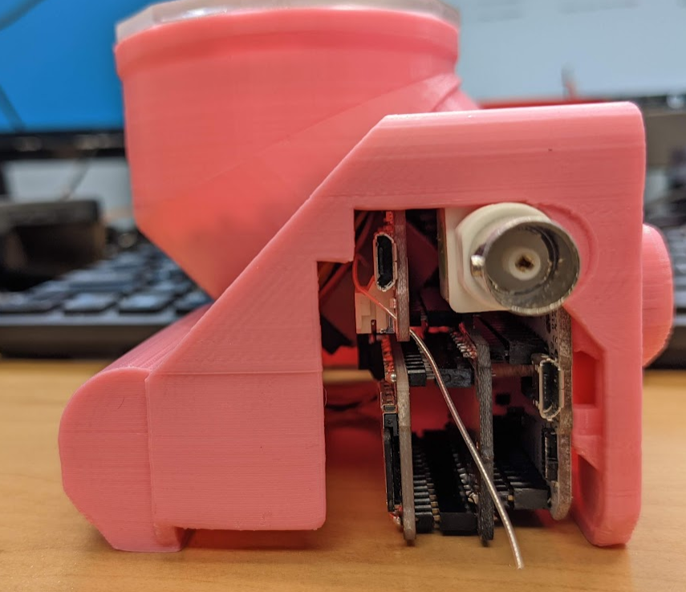

# Catena4610_FED3

The goal of this application for Catena4610 is to read the data from [FED3](https://github.com/KravitzLabDevices/FED3) and send the data over network.

## Integration with Catena 4610

The Catena 4610 also has the following features and transmit them to network.

- LoRaWAN-compatible radio and software

- Bosch BME280 temperature/humidity/pressure sensor

- Silicon Labs Si1133 ambient light sensor

## Getting Started

In order to use this code, you must do several things:

1. Clone this repository into a suitable directory on your system.
2. Install the MCCI Arduino board support package (BSP).
3. Install the required Arduino libraries using `git`.
4. Build the sketch and download to your Catena 4610.

After you have loaded the firmware, you have to set up the Catena 4610.

This sketch uses the Catena-Arduino-Platform library to store critical information on the integrated FRAM. There are several kinds of information. Some things only have to be programmed once in the life of the board; other things must be programmed whenever you change network connections. Entering this information this involves entering USB commands via the Arduino serial monitor.

### Install the MCCI STM32 board support library

Open the Arduino IDE. Go to `File>Preferences>Settings`. Add `https://github.com/mcci-catena/arduino-boards/raw/master/BoardManagerFiles/package_mcci_index.json` to the list in `Additional Boards Manager URLs`.

If you already have entries in that list, use a comma (`,`) to separate the entry you're adding from the entries that are already there.

Next, open the board manager. `Tools>Board:...`, and get up to the top of the menu that pops out -- it will give you a list of boards. Search for `MCCI` in the search box and select `MCCI Catena STM32 Boards`. An `[Install]` button will appear to the right; click it.

Then go to `Tools>Board:...` and scroll to the bottom. You should see `MCCI Catena 4610`; select that.

### Select your desired region

When you select a board, the default LoRaWAN region is set to US-915, which is used in North America and much of South America. If you're elsewhere, you need to select your target region. Use option `Tools>LoRaWAN Region...` and choose the appropriate entry from the menu.

### Select the Serial interface

When you select the board, the default Serial interface is set to `USB Serial`, which is used to get the serial logs. As this sketch uses Hardware serial to communicate with FED3 device, it is necessary to select `USB + HW Serial` in Serial interface.

### Installing the required libraries

This sketch uses several sensor libraries.

The script [`git-boot.sh`](https://github.com/mcci-catena/Catena-Sketches/blob/master/git-boot.sh) in the top directory of this repo will get all the things you need.

It's easy to run, provided you're on Windows, macOS, or Linux, and provided you have `git` installed. We tested on Windows with git bash from [`git-scm.org`](https://git-scm.org), on macOS 10.11.3 with the git and bash shipped by Apple, and on Ubuntu 16.0.4 LTS (64-bit) with the built-in bash and git from `apt-get install git`.

```console
$ cd Catena4610_FED3
$ ../git-boot.sh
Cloning into 'Catena-Arduino-Platform'...
remote: Counting objects: 1201, done.
remote: Compressing objects: 100% (36/36), done.
remote: Total 1201 (delta 27), reused 24 (delta 14), pack-reused 1151
Receiving objects: 100% (1201/1201), 275.99 KiB | 0 bytes/s, done.
Resolving deltas: 100% (900/900), done.
...

==== Summary =====
No repos with errors
No repos skipped.
*** no repos were pulled ***
Repos downloaded:      Catena-Arduino-Platform arduino-lorawan Catena-mcciadk arduino-lmic MCCI_FRAM_I2C Adafruit_BME280_Library Adafruit_Sensor
```

It has a number of advanced options; use `../git-boot.sh -h` to get help, or look at the source code [here](https://github.com/mcci-catena/Catena-Sketches/blob/master/git-boot.sh).

#### List of required libraries

This sketch depends on the following libraries.

* [`github.com/mcci-catena/Catena-Arduino-Platform`](https://github.com/mcci-catena/Catena-Arduino-Platform)
* [`github.com/mcci-catena/arduino-lorawan`](https://github.com/mcci-catena/arduino-lorawan)
* [`github.com/mcci-catena/Catena-mcciadk`](https://github.com/mcci-catena/Catena-mcciadk)
* [`github.com/mcci-catena/arduino-lmic`](https://github.com/mcci-catena/arduino-lmic)
* [`github.com/mcci-catena/MCCI_FRAM_I2C`](https://github.com/mcci-catena/MCCI_FRAM_I2C)
* [`github.com/mcci-catena/Adafruit_BME280_Library`](https://github.com/mcci-catena/Adafruit_BME280_Library)
* [`github.com/mcci-catena/Adafruit_Sensor`](https://github.com/mcci-catena/Adafruit_Sensor)

### Load the sketch into the Catena

Make sure the correct port is selected in `Tools`>`Port`.

Load the sketch into the Catena using `Sketch`>`Upload` and move on to provisioning.

## Provision your Catena 4610

In order to provision the Catena, refer the following document: [How-To-Provision-Your-Catena-Device](https://github.com/mcci-catena/Catena-Sketches/blob/master/extra/How-To-Provision-Your-Catena-Device.md).

## Device setup

The connection diagram of FED3 device to Catena 4610 is shown in the below picture



## Pin Connection

Catena4610 | FED3
---------- | -----
D0 (Rx) | A0
GND | GND

## Interposer Board

An interposer board has been designed to make the above connection between Catena4610 and FED3, so that Catena4610 can fit into the FED3 case. Please find the pictures of interposer (Catena4610 with FED3) below:



Above picture shows the interposer board being used to make connection between Catena4610 and FED3.



Above picture shows the top-view of Catena4610 and FED3, which is connected using interposer board.



Above picture shows the outcome of placing Catena4610 and FED3 inside the pellet dispenser case. The picture is clear, that it is possible update FW of Catena4610 with opening side panel in the case.

## Meta

### License

This repository is released under the [MIT](./LICENSE) license. Commercial licenses are also available from MCCI Corporation.

### Support Open Source Hardware and Software

MCCI invests time and resources providing this open source code, please support MCCI and open-source hardware by purchasing products from MCCI, Adafruit and other open-source hardware/software vendors!

For information about MCCI's products, please visit [store.mcci.com](https://store.mcci.com/).

### Trademarks

MCCI and MCCI Catena are registered trademarks of MCCI Corporation. LoRaWAN is a registered trademark of the LoRa Alliance. LoRa is a registered trademark of Semtech Corporation. All other marks are the property of their respective owners.